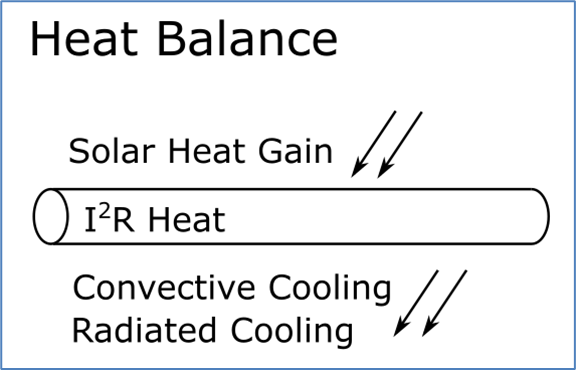
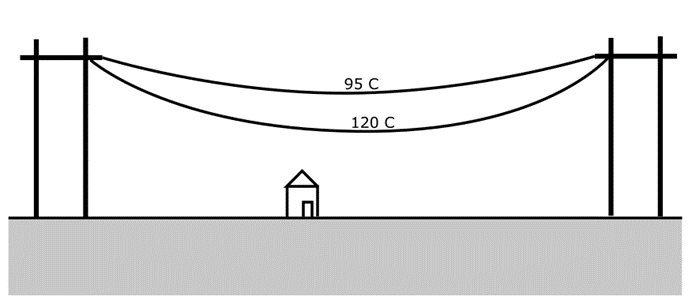

# IEEE738 Primer

## Heat Balance Equations

There's a lot going on in IEEE738, but it comes down to the heat balance equations.  

Solar heat gain:
- Latitude
- Sun Position
  - Day of year
  - Hour of day
- Absorptivity of conductor

Radiated Cooling:
- Conductor Diameter
- Emissivity

Convective Cooling:
- Ambient Tmperature
- Wind speed
- Wind Angle

Heat gain from current:
- Resistance
- Current 

These aren't a complete list of parameter.

## Max Operating Temperature (MOT) of Conductor

The maximum operating temperature (MOT) is typically determined by:
- The physical properties of the conductor - what temperature causes permanent damage (loss of strength) to the conductor
- The sag of the conductor and the clearance underneath the line  

As the conductor heats up it begins to sag, at some temperature the conductor may sag so much 
that it gets too close to structure underneath the line. 

This means that the same conductor could have a different MOTs based on the installation locaiton.
For example, in our example network we see `336.4 ACSR 30/7 ORIOLE` has an MOT of 75C in some locations
and a MOT of 85C in other locations.   

## Steady State Ratings

Note that IEEE738 provides equations to calculate the steady-state conductor temperature and the transient conductor
temperature. All the calculations in the project use the steady-state calculations.

The transient calcualtions are primarily used to evaluate how a conductor behaves immediately after a fault. 

## Notes from Industry

In 2021 FERC approved Order 881 - FERC describes the rationale for the order: 

> Transmission line ratings represent the maximum transfer capability of each transmission line and can change based on weather conditions. 
> This final rule requires all transmission providers, both inside and outside of organized markets, to use ambient-adjusted ratings
> as the basis for evaluating near-term transmission service to increase the accuracy of near-term line ratings. 
> Typically, line ratings are based on conservative assumptions about worst case, long-term air temperature and other weather conditions 
> that can lead to underutilization of our transmission grid.

